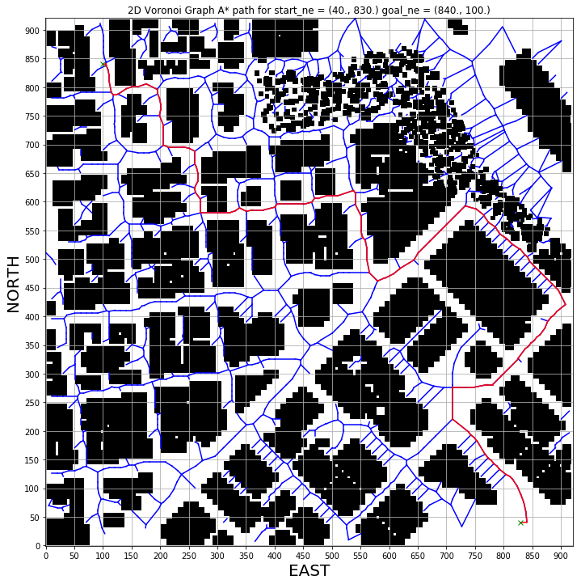
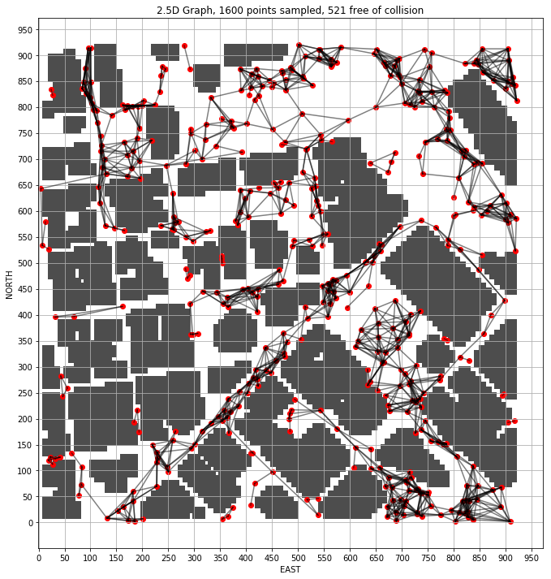
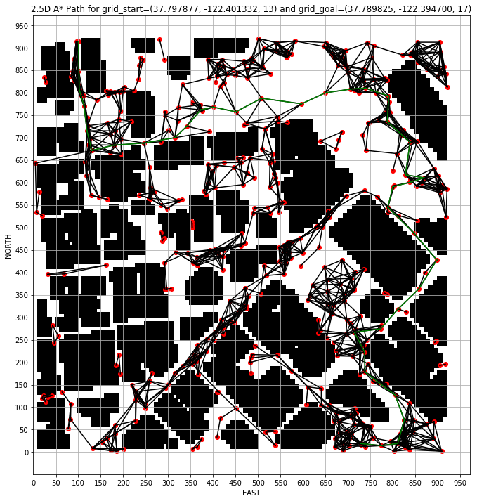
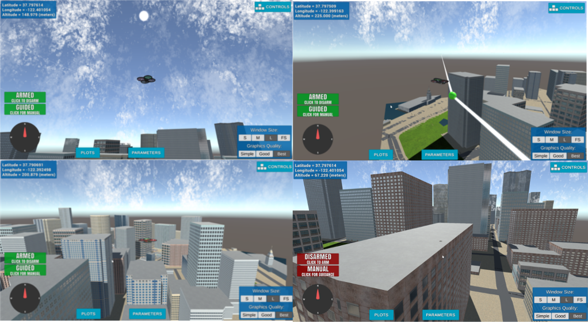
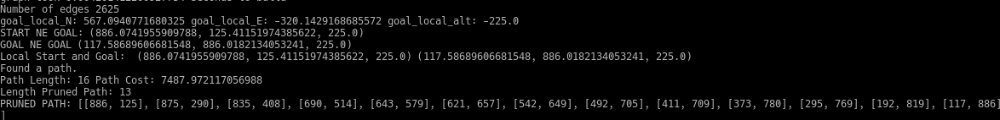

## Project: 3D Motion Planning


---

# Required Steps for a Passing Submission:
1. Load the 2.5D map in the colliders.csv file describing the environment.
2. Discretize the environment into a grid or graph representation.
3. Define the start and goal locations.
4. Perform a search using A* or other search algorithm.
5. Use a collinearity test or ray tracing method (like Bresenham) to remove unnecessary waypoints.
6. Return waypoints in local ECEF coordinates (format for `self.all_waypoints` is [N, E, altitude, heading], where the drone’s start location corresponds to [0, 0, 0, 0].
7. Write it up.
8. Congratulations!  Your Done!

## [Rubric](https://review.udacity.com/#!/rubrics/1534/view) Points
### Here I will consider the rubric points individually and describe how I addressed each point in my implementation.  

---
### Explain the Starter Code

#### 1. Explain the functionality of what's provided in `motion_planning.py` and `planning_utils.py`

The first difference between the backyard_flyer_solution.py vs motion_planning.py is that the latter contains a PLANNING STATE, which triggers an state callback to self.plan_path(). 

In the backyard_flyer_solution.py the waypoint_transition function receives hard coded transition points to fly an square patern of size 10mx10m with a 3m altitude. 
The starter code for motion_planning.py uses A* to find a path in a grid generated from the information contained in the colliders.csv, this file provide us with the grid size, expressed in North and East dimensions, the grid center or offset, as well as the center of the obstacles coordinates and its volume in form of delta values from the center.

 A grid of dimensions north_size * east_size will be generated to represent the world of our planning and search space, where the free space will be marked with "0" and the obstacles represented by "1". Starter code only has vertical and horizontal ACTIONS for our drone, this is why we see the drone moving in a jerky way as it is jumping 1 space horizontal or 1 vertical at a time to reach the Goal 10m away from its starting position. The starting position of the drone is given by the central coordinates NE (north_offset = north_min, east_offset = east_min) returned by the create_grid function call.

A* will return a complete and optimal path (for grids and metric graphs representations) to the goal location using Manhatthan heuristic to update the cost of the partial paths generated, and the final cost of the optimal path as well. 
The cost of each horizontal or vertical action has a default cost of "1", as it is moving 1 horizontal or vertical position at a time. The Manhattan heuristic funtion will return difference beween the current position of the drone on the grid to the position of the Goal cell. 

Once a path is returned by the A* method, the waypoints are obtained by offsetting the coordinates in the path by the grid origin (north_offset = north_min, east_offset = east_min), and these waypoints are sent to the simulator trhough the Mavlink connection.

Once the waypoints are defined, these are packed as binary bytes serialized by the msgpack and sent to the simulator through mavlink_connection -> pymavlink - > mavserial. 

Once the drone is on WAYPOINT transition state, the LOCAL_POSITION callback checks on the local_position of the drone compared to its target_position to control the flight path by sending cmd_position instructions from goal to destination, similar to how the drone is controlled in the back_flyer_solution.py. 


### Implementing Your Path Planning Algorithm

#### 1. Set your global home position [FCND-Motion_Planning_graphs/motion_planing.py:lines(125,132)]

Open the file using the csv library and read the column[0] and column[1] of the first row, ; we are only interested on the values so we drop the variables names by reading only from the 5th character to the end of the column. Finally we cast the value to float type.

```
# Read lat0, lon0 from colliders into floating point values
with open('colliders.csv', newline='') as f:
    reader = csv.reader(f)
    row1 = next(reader)  # gets the first line
    lat0, lon0 = float(row1[0][5:]), float(row1[1][5:])
    
# Set home position to (lat0, lon0, 0)
self.set_home_position(lon0, lat0, 0)  # set the current location to be the home position

```

#### 2. Set your current local position [FCND-Motion_Planning_graphs/motion_planing.py:lines(134,138)]

We can access the local position from the variables available at the Drone class implementation. Then we can use the method global_to_local from the udacidrone/frame_utils.py to convert the geodetic values to NED coordinates.

```
# Retrieve current global position
current_global_pos  = (self._longitude, self._latitude, self._altitude)

# Convert to current local position using global_to_local()
current_local_pos = global_to_local(current_global_pos, self.global_home)

```

#### 3. Set grid start position from local position [FCND-Motion_Planning_graphs/motion_planing.py:lines(166,167)]

We can use the current_local_pos from the previous step and offset it by the grid's origin to assign the start location to the current location of the Drone.

```
# Convert start position to current position rather than map center
grid_start = (int(current_local_pos[0]-north_offset), int(current_local_pos[1]-east_offset))

```

#### 4. Set grid goal position from geodetic coords [FCND-Motion_Planning_graphs/motion_planing.py:lines(169,172)]

For this step first we set the Goal Position in geodetic coordinates in the goal_global_pos variable, then this is converted to NED coordinates using the global_to_local method; only if using graphs, we find the closest point to the Goal using the closest_point method.

```
# Adapt to set goal as latitude / longitude position and convert

# Enter the geodetic coordinates for the Goal Position
goal_global_pos = (-122.394700, 37.789825, 13)

# Map geodetic coordinates to NED coordinates and set the goal position by applying the center of the grid offset
goal_local_pos = global_to_local(goal_global_pos, self.global_home)
grid_goal = (int(goal_local_pos[0]-north_offset), int(goal_local_pos[1]-east_offset), goal_global_pos[2])

# Only if usign graphs for grid representation
# Find the closest point in the graph to the goal chosen
goal_ne_g = closest_point(G, grid_goal)

```

#### 5. Modify A* to include diagonal motion (or replace A* altogether) [FCND-Motion_Planning_graphs/motion_planing.py:lines(185)]

In order to support diagonal actions we need to add them in the Action class at the planning_utils.py file, a diagonal movement involves a displacement of 1 horizontal and 1 vertical cell at a time, and this displacement has a cost of sqrt(2), a total of 4 diagonal movements are possible: NORTH_WEST, NORTH_EAST, SOUTH_WEST, and SOUTH_EAST.

Diagonal actions need to be validated against going out of the grid limits, (0 < Action < n,m); Actions need to be validated against crashing against obstacles, which are represented by a value "1" in the grid. A* search method involves the Diagonal displacements by calling the valid_actions function, it will select the Actions that represent the lowest cost from start to goal position. 

```
# Added actions to support diagonal movements in the Action class at the planning_utils.py file
NORTH_WEST = (-1, -1, np.sqrt(2))
SOUTH_WEST = (1, -1, np.sqrt(2))
SOUTH_EAST = (1, 1, np.sqrt(2))
NORTH_EAST = (-1, 1, np.sqrt(2))

# Added conditionals to check for valid_actions at the valid_actions method
if x - 1 < 0 or y - 1 < 0 or grid[x - 1, y - 1] == 1:
    valid_actions.remove(Action.NORTH_WEST)
if x + 1 > n or y - 1 < 0 or grid[x + 1, y - 1] == 1:
    valid_actions.remove(Action.SOUTH_WEST)
if x + 1 > n or y + 1 > m or grid[x + 1, y + 1] == 1:
    valid_actions.remove(Action.SOUTH_EAST)
if x - 1 < 0 or y + 1 > m or grid[x - 1, y + 1] == 1:
    valid_actions.remove(Action.NORTH_EAST)
```

For a graph representation using Voronoi in combination with grid representations, metric graphs, the idea is to use Voronoi together with the obsctacles' center points as seed values to obtain a Graph representation, then using bresenham algorithm, we can get all the cells composing the path from p1 to p2 of an edge in the graph. We check for collisions and out of grid limitations to decide whether the chosen edge can be included in the final graph; once we got the edges out of colision we can use the python package NetworkX to generate the graph, and using the eucledian distance to assign a cost to every edge in the graph. A 2D metric graph based solution is proposed in the files contained in the FCND-Motion-Planning_graphs directory.

Make sure to update line 171 in the motion_planning.py file with a goal geodetic coordinates to find a path from start to goal using A\*; e.g. goal_global_pos = (-122.401278, 37.797193)



A final approach was using a 2.5D graph, where the search space is sampled with Random Points within the range (north_min to north max, east_min to east_max, alt_min to alt_max), the random points are checked against the the representation Polyhedra of the colliders generated using the python Shapely library; the sklearn KDTree library is used to find the nearest obstacles neighboors for a given point, and then validate whether the point is out of the area of the obstacles found.

Next step is to connect the random points generated to form the Graph edges, to do this we will make use of the KDTree library again, but this time is to find the points closest neihboors for a given point, we are just interested on connecting those points who are closer to each other instead of validating connections for the complete sampled points. Once the closest points neihboors are found, we check whether 2 connecting points forming an edge are free of collision, checking for crossings between Point A and Point B and a polygon obstructing the connection, as well as whether both connecting points have a larger altitude than the obstacle; edges free of collision are connected again using the NetworkX python package.

In the figure below we show a Graph generted using the Probabilistic Roadmap method, it is for a sample of 1200 nodes before collision validation. A SAFETY_DISTANCE=7 is used to avoid for collisions, this large value for SAFETY_DISTANCE is needed to compensate the discrepancies between the collinders.csv file and the Unity Simulator. 



Generating a Graph in 2.5D using Probabilistic Roadmap can be time consuming, the larger the number of samples taken the most expensive it becomes, and with this the MavlinkConnection timeout is easily exceded. As a workaround the 2.5D Graph is generated separately in a Jupyter Notebook and it is saved as a gpickle file, same file that is used in the motion_planing.py program to perform A* search on it. 

The provided 2.5D Graph file in this project is graph_1200_SD_nodes.gpikle, and the connections are shown in the next figure . We can see from the figure that connections don't spread accross narrow roads, we can attribute this to the relatively large SAFETY_DISTANCE used to avoid collisions. A larger number of samples could be attempted trying to connect the most areas of the search space if needed.

The following figure shows the results of performing A* search over our 2.5D representation of the world, the coordinates are grid_start=(37.797877, -122.401332, 13) and grid_goal=(37.793710, -122.395325, 19). It is important to provide the altitude in the start and goal coordinates, as we map these values to the closest_point, and in case that the altitude is not provided the resulting mapping of coordinates could result different to what is expected. A grid_points_1200.csv file is provided including all the NED coordinates in the figure to help with the goal's coordinates selection.

A 2.5D graph based solution is proposed in the files contained in the FCND-Motion-Planning_25D directory.
Make sure to update line 171 in the motion_planning.py file with a goal geodetic coordinates to find a path from start to goal using A\* search; e.g. goal_global_pos = (-122.394700, 37.789825, 13)




#### 6. Cull waypoints [FCND-Motion_Planning_graphs/motion_planing.py:lines(191,193)]

Checking for colliniarity betwen 3 points, Area = det([p1 p2 p3]) = 0 will be sufficient for points represented in 2D, where the 3rd dimension can be set to be the same value for the 3 points. 

In a 2.5D graph we can check for collinearity in the same way we are doing for a 2D representation, but instead of using the 3rd dimension to be the same for all the waypoints, the p[3] value of every point in the pruned_path is set in the waypoints for the alltitude displacement to take place for every cmd_position sent to the simulator.  

An application for a 2.5D representation of the world were the altitude is sampled for a value > 212 + safety_dstance, which means that every waypoint in a plan will be executed above the alt_max defined by the tallest building in the search space. This type of plan allows the drone to travel to any location in the graph with a highly pruned trajectory for lage values of epsilon, which in many cases will be the wanted behaviour. When the number of points is asympotically infinite, the optimal path is guaranted. 



Prunning the path involves to iteratively check on every point in the path found by the A* method, and then use the collinearity_check function to find the determinant between the 3 points, finally we compare the determinat to the value of epsilon to allow for a felxible pruning depending of our application goals. 




```
path, cost = a_star_graph(G, heuristic_graph, start_ne_g, goal_ne_g)
int_path = [[int(p[0]), int(p[1]), int(p[2])] for p in path]        
#Prune path to minimize number of waypoints
pruned_path = prune_path(int_path)

# Convert path to waypoints
waypoints = [[p[0] + north_offset, p[1] + east_offset, p[2], 0] for p in pruned_path]
```


### Execute the flight
#### 1. Does it work?
It works!
