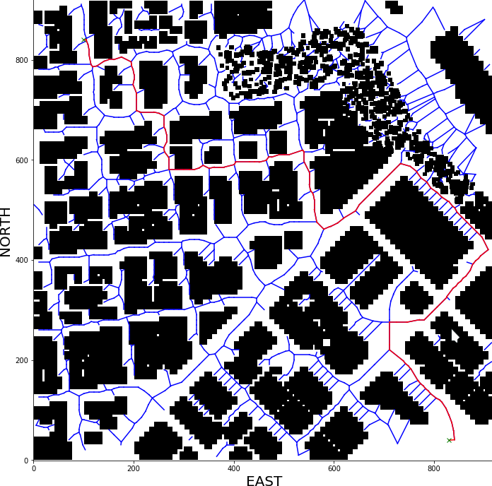

## Project: 3D Motion Planning


---


# Required Steps for a Passing Submission:
1. Load the 2.5D map in the colliders.csv file describing the environment.
2. Discretize the environment into a grid or graph representation.
3. Define the start and goal locations.
4. Perform a search using A* or other search algorithm.
5. Use a collinearity test or ray tracing method (like Bresenham) to remove unnecessary waypoints.
6. Return waypoints in local ECEF coordinates (format for `self.all_waypoints` is [N, E, altitude, heading], where the drone’s start location corresponds to [0, 0, 0, 0].
7. Write it up.
8. Congratulations!  Your Done!

## [Rubric](https://review.udacity.com/#!/rubrics/1534/view) Points
### Here I will consider the rubric points individually and describe how I addressed each point in my implementation.  

---
### Writeup / README

#### 1. Provide a Writeup / README that includes all the rubric points and how you addressed each one.  You can submit your writeup as markdown or pdf.  

### Explain the Starter Code

#### 1. Explain the functionality of what's provided in `motion_planning.py` and `planning_utils.py`

The first difference between the backyard_flyer_solution.py vs motion_planning.py is that the latter contains a PLANNING STATE, which triggers an state callback
to self.plan_path(). 

In the backyard_flyer_solution.py the waypoint_transition function receives hard coded transition points to fly an square patern of size 10mx10m with a 3m altitude. 
The starter code for motion_planning.py uses A* to find a path in a grid from the information contained in the colliders.csv, this file provide us with the North and East
dimension of the grid, as well as the center of the obstacles in NED coordinates, and the size of them in form of delta values.  

 A grid of north_size * east_size will be generated to represent the world, where the free space will be marked with "0" and the obstacles represented by "1". Starter code only 
has vertical and horizontal ACTIONS for our drone, this is why we see the drone moving in a saggy way as it is jumping 1 space horizontal or 1 vertical at a time to reach the Goal 10m 
ahead of its starting position. The starting position of the drone is given by the central cordinates NE (north_offset = north_min, east_offset = east_min) returned by the create_grid function call.

A* will return a complete and optimal path to the goal location using Manhatthan heuristic to update the cost of the partial paths being generated, and the final cost of the optimal path as well. 
The cost of each horizontal or vertical action has a default cost of "1", as it is moving 1 horizontal or vertical position at a time. The Manhattan heuristic funtion will return difference beween the current 
position of the drone of the grid compared to the position of the Goal cell. 

Once an optimal and complete path is returned by the A* method, the waypoints are obtained by offsetting the coordinates in the path by the grid origin (north_offset = north_min, east_offset = east_min), 
and these waypoints are sent to the drone trhough the Mavlink connection.

Once the waypoints are defined, these are packed as a binary bytes serialized by the msgpack and sent to the drone through mavlink_connection -> pymavlink - > mavserial. 
Once the drone is in WAYPOINT transition state, the LOCAL_POSITION callback checks on the local_position of the drone compared to its target_position to control the flight path 
by sending cmd_position instructions from goal to destination, similar to how the drone is controlled in the back_flyer_solution.py file. 

And here's a lovely image of my results (ok this image has nothing to do with it, but it's a nice example of how to include images in your writeup!)


Here's | A | Snappy | Table
--- | --- | --- | ---
1 | `highlight` | **bold** | 7.41
2 | a | b | c
3 | *italic* | text | 403
4 | 2 | 3 | abcd

### Implementing Your Path Planning Algorithm

#### 1. Set your global home position
Here students should read the first line of the csv file, extract lat0 and lon0 as floating point values and use the self.set_home_position() method to set global home. Explain briefly how you accomplished this in your code.

First open the file using the csv library, and read the first line column[0] and column[1]; we are only interested on the values so we drop the variables names by ready from the 5th character only. Finally we cast
the value to float.

```
# TODO: read lat0, lon0 from colliders into floating point values
with open('colliders.csv', newline='') as f:
    reader = csv.reader(f)
    row1 = next(reader)  # gets the first line
    lat0, lon0 = float(row1[0][5:]), float(row1[1][5:])
    
# TODO: set home position to (lat0, lon0, 0)
self.set_home_position(lon0, lat0, 0)  # set the current location to be the home position

```

And here is a lovely picture of our downtown San Francisco environment from above!


#### 2. Set your current local position
Here as long as you successfully determine your local position relative to global home you'll be all set. Explain briefly how you accomplished this in your code.

We can access the local position from the variables available at the Drone class implementation as show in the line of code next. Then we can use the method global_to_local from the udacidrone/frame_utils.py 
to convert the geodetic values to NED coordinates.

```
# TODO: retrieve current global position
current_global_pos  = (self._longitude, self._latitude, self._altitude)

# TODO: convert to current local position using global_to_local()
current_local_pos = global_to_local(current_global_pos, self.global_home)

```
Meanwhile, here's a picture of me flying through the trees!


#### 3. Set grid start position from local position
This is another step in adding flexibility to the start location. As long as it works you're good to go!

We can use the current_local_pos from the previous step and offset it by the map center to assign the start location to the last location were the Drone landed.

```
# TODO: convert start position to current position rather than map center
grid_start = (int(current_local_pos[0]-north_offset), int(current_local_pos[1]-east_offset))

```

#### 4. Set grid goal position from geodetic coords
This step is to add flexibility to the desired goal location. Should be able to choose any (lat, lon) within the map and have it rendered to a goal location on the grid.

For this step first we set the Goal Position in geodetic coordinates in the goal_global_pos variable, then this is converted to NED coordinates using the global_to_local method, finally we find the closest point 
to the Goal point chosen using the closest_point method.

```
# TODO: adapt to set goal as latitude / longitude position and convert

# Enter the geodetic coordinates for the Goal Position
goal_global_pos = (-122.401048, 37.797610, 225)

# Map geodetic coordinates to NED coordinates and set the goal position by applying the center of the grid offset
goal_local_pos = global_to_local(goal_global_pos, self.global_home)
grid_goal = (int(goal_local_pos[0]-north_offset), int(goal_local_pos[1]-east_offset), goal_global_pos[2])

# Find the closest point in the graph to the goal chosen
goal_ne_g = closest_point(G, grid_goal)

```

#### 5. Modify A* to include diagonal motion (or replace A* altogether)
Minimal requirement here is to modify the code in planning_utils() to update the A* implementation to include diagonal motions on the grid that have a cost of sqrt(2), but more creative solutions are welcome. Explain the code you used to accomplish this step.

In order to support diagonal actions we need to add them in the Action class at the planning_utils.py file, a diagonal movement involves the drone displacement of 1 horizontal and 1 vertical cell at a time, and this displacement has
a cost of sqrt(2), a total of 4 diagonal movements are possible: NORTH_WEST, NORTH_EAST, SOUTH_WEST, and SOUTH_EAST.

Diagonal actions need to be validated against going out of the grid limits, (0 < Action < n,m); Actions need to be validated against crashing with obstacles on the world representation, which are represented by a value "1" in the grid. A* search method involves the Diagonal displacements by calling the valid_actions function, and the will select the Actions that represent the lowest path from start to goal. 

```
# Added actions to support diagonal movements in the Action class at the planning_utils.py file
NORTH_WEST = (-1, -1, np.sqrt(2))
SOUTH_WEST = (1, -1, np.sqrt(2))
SOUTH_EAST = (1, 1, np.sqrt(2))
NORTH_EAST = (-1, 1, np.sqrt(2))

# Added conditional to check for valid_actions at the valid_actions method
if x - 1 < 0 or y - 1 < 0 or grid[x - 1, y - 1] == 1:
    valid_actions.remove(Action.NORTH_WEST)
if x + 1 > n or y - 1 < 0 or grid[x + 1, y - 1] == 1:
    valid_actions.remove(Action.SOUTH_WEST)
if x + 1 > n or y + 1 > m or grid[x + 1, y + 1] == 1:
    valid_actions.remove(Action.SOUTH_EAST)
if x - 1 < 0 or y + 1 > m or grid[x - 1, y + 1] == 1:
    valid_actions.remove(Action.NORTH_EAST)
```

For a graph representation using Voronoi and Medial Axis methods, metric graphs, the idea is to use Voronoi together with the obsctacles center points to obtain a Graph representation, then using bresenham algorithm, we can get all the cells composing the path from p1 to p2 of an edge in the graph, and then we check for collisions and out of grid limitations to decide whether the chosen edge can be included in 
the final graph; once we got the edges out of colision we can use the python package NetworkX to generate the graph, and using the eucledian distance to assign a cost to every edge in the graph.
A 2D metric graph based solution is proposed in the files contained in the FCND-Motion-Planning_graphs directory.



A final approach was using a 2.5D graph, where our World is sampled with Random Points within a range (north_min to north max, east_min to east_max, alt_min to alt_max), the random points are connected using the Shapely Package to generate the Polyhedra representation of the obsctacles, and the KDTree scikit mehtod to find the nearest neighboors of a given point, this will allow us to find the edges that are not in colision, checking for crossings between Point A and Point B and a polygon obstructing the connection, as well as whether both connecting points have a larger altitude than the obstacle; edges are connected again using the NetworkX python package. 

In the figure below we show a Graph generted using the Probabilistic Roadmap method, it was generated with a sample of 1200 nodes out of which only 521 are free of collision. A SAFETY_DISTANCE=7 is used to avoid for collisions, this large SAFETY_DISTANCE is to compensate the discrepancies between the collinders.csv file and the Unity Simulator. 

Generating a Graph in 2.5D using Probabilistic Roadmap can be time consuming, the larger number of samples taken the most expensive it becomes, and with this the MavlinkConnection timeout is easily exceded. As a workaround the Graph is generated in a Jupyter Notebook and it is saved as a gpickle file, same file that is used in the motion_planing.py file to perform A* search on it. The provided Graph file in this project is graph_1200_SD_nodes.gpikle, and the connections are shown in the next figure . We can see from the figure that connections don't spread accross narrow roads, we can attribute this to the relatively large SAFETY_DISTANCE used to avoid collisions.


The following figure shows the results of performing A* search over our 2.5D World representation, the coordinates are grid_start=(37.797877, -122.401332, 13) and grid_goal=(37.793710, -122.395325, 19). It is important to provide the altitude in the start and goal coordinates, we map these values to the closest_point, and in case that the altitude is not provided the resulting mapping of coordinates could result different to what is expected. A grid_points_1200.csv file is provided including all the NED coordinates in the figure to help with the start and goal points selection.


#### 6. Cull waypoints 
For this step you can use a collinearity test or ray tracing method like Bresenham. The idea is simply to prune your path of unnecessary waypoints. Explain the code you used to accomplish this step.

Checking for colliniarity betwen 3 points, Area = det([p1 p2 p3]) = 0, will be sufficient for points represented in 2D, where the 3rd dimension can be set to the same value for the 3 points to check for collinearity. 
I our 2.5D world representation this condition will also be satisfied if we sample the world with an altitude value > 212 + safety_dstance, which means that all our planned path will be executed above the alt_max defined by the tallest building in our world. This type of fligth plan allows the drone to travel to any location in the world with maximized pruned trajectories for lage values of epsilon, which in many cases will be the applications' wanted behaviour. When the number of points is asympotically infinite, the optimal path is guaranted. 

Prunning the path using collinearity involves to iteratively check for collinearity on every point in the path found by the A* method, and the use the collinearity_check function to find the determinant between the 3 points, finally we compare the determinat to the value of epsilon to allow for a felxible pruning depending of our application conditions. 


```
# We're using collinearity here,
def collinearity_check(p1, p2, p3, epsilon=700):   
    m = np.concatenate((p1, p2, p3), 0)
    det = np.linalg.det(m)
    return abs(det) < epsilon
    
def prune_path(path):
    pruned_path = [p for p in path]
    # TODO: prune the path!
    
    i = 0
    while i < len(pruned_path) - 2:
        p1 = point(pruned_path[i])
        p2 = point(pruned_path[i+1])
        p3 = point(pruned_path[i+2])
        
        # If the 3 points are in a line remove
        # the 2nd point.
        # The 3rd point now becomes and 2nd point
        # and the check is redone with a new third point
        # on the next iteration.
        if collinearity_check(p1, p2, p3):
            # Something subtle here but we can mutate
            # `pruned_path` freely because the length
            # of the list is check on every iteration.
            pruned_path.remove(pruned_path[i+1])
        else:
            i += 1
    return pruned_path
```


### Execute the flight
#### 1. Does it work?
It works!

### Double check that you've met specifications for each of the [rubric](https://review.udacity.com/#!/rubrics/1534/view) points.
  
# Extra Challenges: Real World Planning

For an extra challenge, consider implementing some of the techniques described in the "Real World Planning" lesson. You could try implementing a vehicle model to take dynamic constraints into account, or implement a replanning method to invoke if you get off course or encounter unexpected obstacles.


